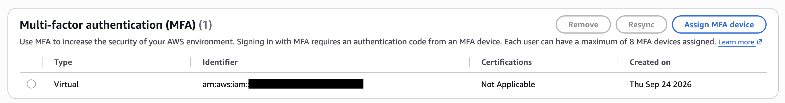
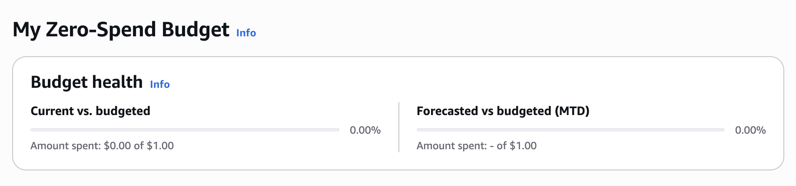
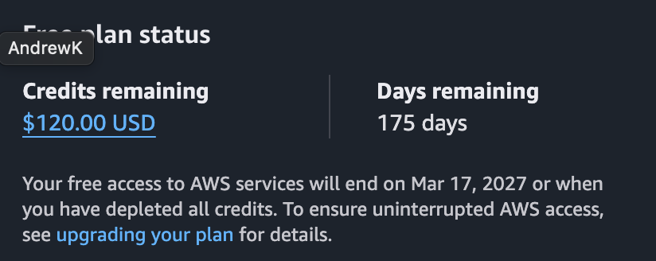

# Week 01 — Cloud fundamentals and account setup

## Deliverable 1: MFA enabled

A virtual MFA device is assigned on the account, created Thu Sep 24 2026.

## Devlierable 2: Zero-spend budget & Free plan

Current spend is $0.00 of a $1.00 budget.

## Deliverable 3: root vs IAM vs Shared Responsibility Model
text placeholder