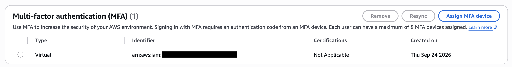
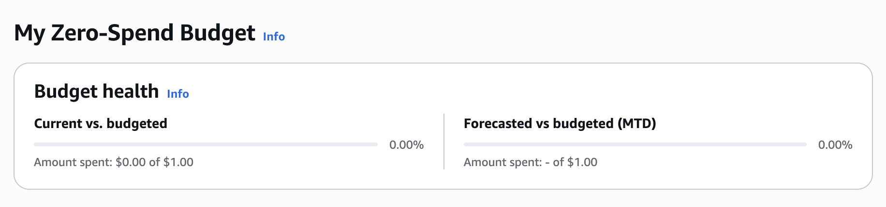
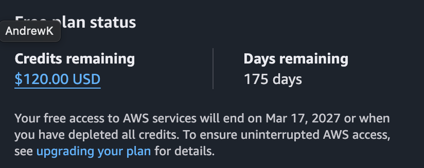

# Week 01 — Cloud fundamentals and account setup

## Deliverable 1: MFA enabled

A virtual MFA device is assigned on the account, created Thu Sep 24 2026.

## Devlierable 2: Zero-spend budget & Free plan

Current spend is $0.00 of a $1.00 budget.

## Deliverable 3: root vs IAM vs Shared Responsibility Model
Root is the account that acts as the master. It has unrestricted control, which means it also is the most critical, necessitating MFA for login. IAM, aka Identity and Access Management, are basic users and roles with specific permissions (given by root). Due to the unrestrictive nature of root, the IAM model is better suited for everyday work. Lastly, shared responsibility is when AWS protects the cloud infrastructure, and users protect their own configurations, stored assets, and runtimes inside the infrastrcture. This could be analogous to a landlord securing the building, and individuals securing the offices inside. 