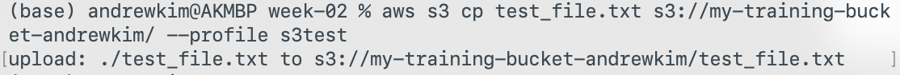
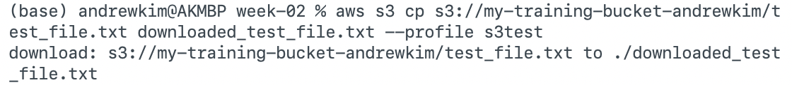
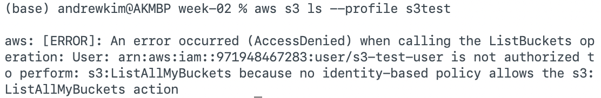

# Week 02 — IAM & Security Foundations

## JSON Policy

`s3-test-user` uses the `s3test` profile and the policy in `[policies/s3-access-policy.json](policies/s3-access-policy.json)`. The policy allows only object upload and download in one bucket:

```json
{
    "Version": "2012-10-17",
    "Statement": [
        {
            "Effect": "Allow",
            "Action": [
                "s3:PutObject",
                "s3:GetObject"
            ],
            "Resource": "arn:aws:s3:::my-training-bucket-andrewkim/*"
        }
    ]
}
```

`s3:PutObject` and `s3:GetObject` act on objects, so the resource is `my-training-bucket-andrewkim/*` rather than the bucket ARN alone. The trailing `/*` matches objects inside that bucket. It does not match the bucket itself, other buckets, or account-level actions such as `s3:ListAllMyBuckets`.

## Tests

Upload with `s3:PutObject`. The `s3test` profile copied `test_file.txt` into the bucket:



Download with `s3:GetObject`. The same profile copied that object back to `downloaded_test_file.txt`:



`aws s3 ls` calls `s3:ListAllMyBuckets`, which this policy does not allow. `s3-test-user` is denied. That denial is the least-privilege result, not a broken upload policy:



## Discussion

The policy is written for least privilege, which means `s3-test-user` only gets the permissions it actually needs. That user uploads a file to the training bucket and downloads it back, so the statement allows `s3:PutObject` and `s3:GetObject`. PutObject is the action behind copying a file up, and GetObject is the action behind copying it back down. The resource is `arn:aws:s3:::my-training-bucket-andrewkim/*`, aka the objects inside that one bucket. PutObject and GetObject act on objects, so the ARN has to end in `/*`. Naming the bucket alone would point at the bucket itself, and the upload would still be denied. Listing buckets, listing the objects inside the bucket, and deleting objects are left out on purpose. IAM denies anything that is not explicitly allowed, which is why `aws s3 ls` returns AccessDenied for `s3:ListAllMyBuckets`. That denial is the expected result. This is analogous to giving someone a key to one office and the files inside it, rather than a master key to the whole building.